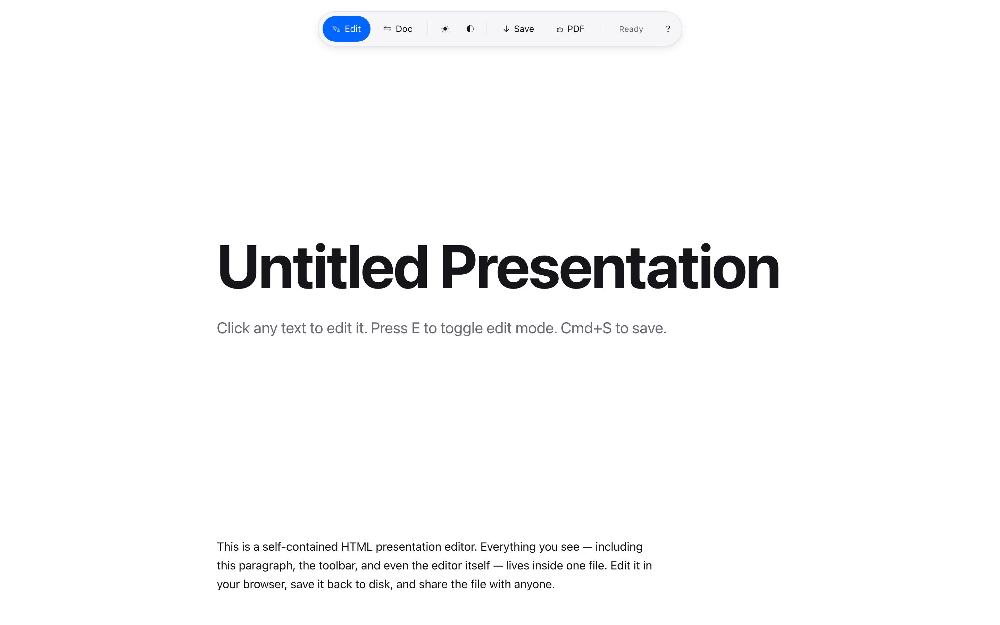
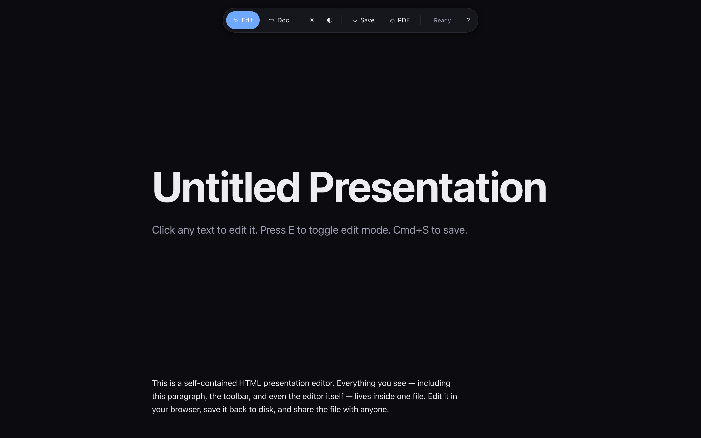
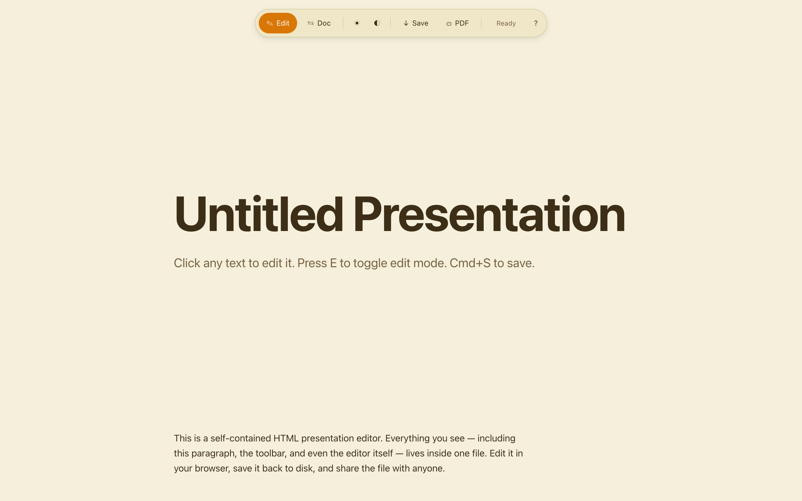
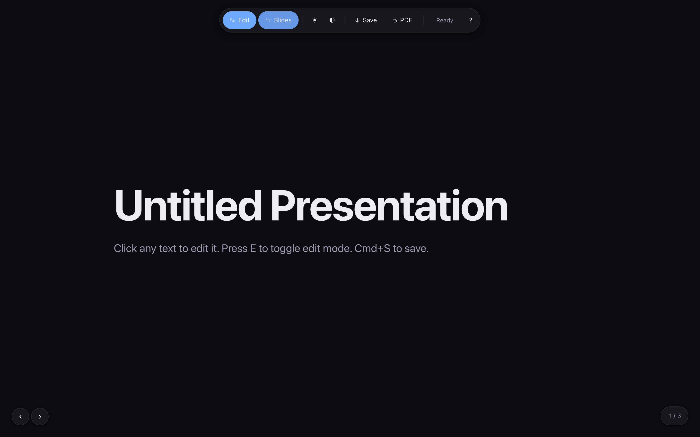
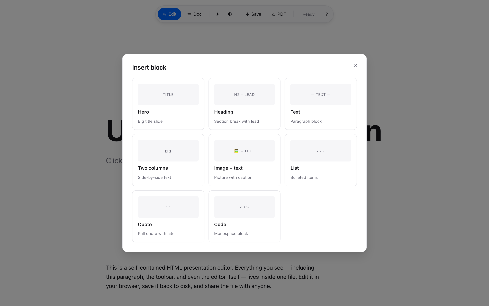
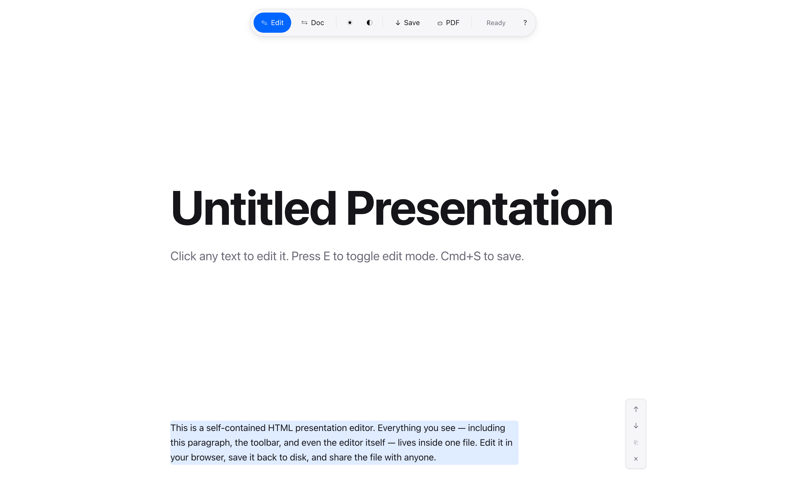

# Presentation Editor

A self-contained HTML presentation editor. **One file. No build. No server.** Open it in your browser, click any text, type. Cmd+S writes back to the same file. Send the file to anyone — they can read it, or edit it the same way you did.



Inspired by [Gleb Kudryavtsev's "Тильда на минималках" post](https://t.me/gleb_pro_ai/558).

## Why

You wanted a beautiful doc. The agent gave you a PDF — pretty, but you can't edit it. Then HTML — you can edit, but only in the source. Google Docs, Notion, Tilda are overkill, lock you in, and require an account.

This is a single HTML file that edits itself. The whole product is the file. The file is the whole product.

## Features

- **One file, zero dependencies.** ~42 KB of vanilla HTML/CSS/JS. No npm, no build, no server.
- **8 block types.** Hero, heading, text, two-column, image+text, list, quote, code.
- **In-page editing.** Click any text. Hover any block to move, duplicate, or delete it.
- **Two views.** Document mode (scroll) or Slides mode (full-screen, arrow-key nav).
- **3 themes × 4 accent palettes.** Light, dark, sepia × default-blue, mono, warm, green.
- **Image swap.** Click any image, pick a local file — embedded as base64. File stays self-contained.
- **PDF export.** `Cmd+P` opens the native print dialog with proper page breaks.
- **Auto-save** to `localStorage` as a safety net. "Restore unsaved" banner if the browser crashed.

## Quick start

1. Download [`editor.html`](editor.html).
2. Open it in your browser.
3. Click any text and type. `Cmd+S` to save.

That's it. No setup.

## How saving works

| Browser | Behavior |
|---------|----------|
| Chrome, Edge, Brave, Opera | First `Cmd+S` opens a save dialog. Pick the same file to overwrite it. After that, `Cmd+S` writes silently in place. ([File System Access API](https://developer.mozilla.org/en-US/docs/Web/API/File_System_Access_API)) |
| Safari, Firefox | `Cmd+S` downloads the updated file. Replace the original manually. |

The saved file is a fully working editor — open it again to keep editing. Toolbar, controls, and inserted UI never touch the disk; they're injected by JS on load and stripped on save.

## Keyboard shortcuts

| Key | Action |
|-----|--------|
| `E` | Toggle edit / preview |
| `S` | Toggle doc / slides mode |
| `Cmd+S` | Save |
| `Cmd+P` | Print / export PDF |
| `← →`, Space | Navigate slides (in slides mode) |
| `?` | Show all shortcuts |
| `Esc` | Close dialogs / unfocus |

## Screenshots

| Light | Dark | Sepia |
|-------|------|-------|
|  |  |  |

| Slides mode | Insert block picker | Hover controls |
|-------------|---------------------|----------------|
|  |  |  |

## Browser support

- **Full features:** Chromium-based browsers (Chrome 86+, Edge, Brave, Opera, Arc).
- **Edit + download save:** Safari 16+, Firefox 100+.
- **Tested on:** Chromium 1217 via Playwright (zero console errors).

## Project layout

```
editor.html          ← the entire product
screenshots/         ← README assets
LICENSE              ← MIT
README.md            ← this file
```

## Contributing

Issues and PRs welcome. Keep it simple — the constraint is "one file, no dependencies." If a feature needs a build step or third-party library, it probably belongs in a fork, not here.

## License

[MIT](LICENSE) — do whatever you want.

## Credits

- Idea by [@gleb_pro_ai (post 558)](https://t.me/gleb_pro_ai/558)
- Built with [Claude Code](https://claude.com/claude-code) by Ilya Chernetskiy
